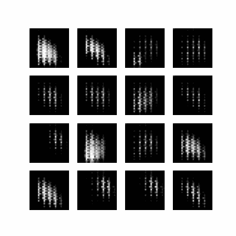

# 🧠 DCGAN Projects: Fashion MNIST & CelebA

This repository contains two deep learning projects implementing **Deep Convolutional Generative Adversarial Networks (DCGAN)** to synthesize images:

- **Fashion MNIST** — Generates grayscale clothing images.
- **CelebA** — Synthesizes realistic face images.

Both models are built with TensorFlow and follow adversarial training between Generator and Discriminator networks.

---

## 🧥 Fashion MNIST DCGAN

- **Input**: 28x28 grayscale images
- **Generator**:
  - Dense and reshape to 7x7x256
  - Upsample using Conv2DTranspose with BatchNorm + LeakyReLU
- **Discriminator**:
  - Conv2D layers + Dropout
  - Outputs 2 logits (Fake/Real)
- **Loss**: Categorical cross-entropy from logits
- **Training**:
  - 80 epochs
  - Noise vector size: 100
  - Batch size: 256
  - Normalized image range: `[-1, 1]`

---

## 😎 CelebA DCGAN

- **Input**: 64x64 RGB cropped CelebA faces
- **Generator**:
  - Dense to 4x4x1024 followed by progressive upsampling
  - Final output shape: 64x64x3 with `tanh` activation
- **Discriminator**:
  - Deep Conv2D with dropout and softmax output
- **Loss**: Categorical cross-entropy with logits
- **Training**: 
  - 100 epochs
  - Noise vector size: 100
  - Batch size: 256
  - Normalized image range: `[-1, 1]`

---

## 🧪 Results & Checkpoints
- Generated images saved at regular intervals
- Fixed seed vectors ensure consistent visual progress
- Checkpoints saved every 15 epochs

---

## 📸 Sample Outputs




---

## 📌 Notes
- CelebA dataset must be downloaded manually and resized to 64x64
- Training benefits from GPU acceleration
- Both models demonstrate adversarial convergence over time

---

## How to Run the Code
1. Clone the repository:

   ```
   https://github.com/nakhani/DCGAN.git
   ```

2. Navigate to the directory:

   ```
   DCGAN
   ```

3. Install the required packages:
   ```sh
   pip install -r requirements.txt
   ```

4. Run the project:
   ```bash
    jupyter notebook FashionMnist.ipynb #For Training FashionMnist Dataset with DCGAN
    jupyter notebook CelebA.ipynb #For Training CelebA Dataset with DCGAN
   ```
---
## Dependencies
- Python 3.x
- TensorFlow / PyTorch
- NumPy
- Matplotlib
- Pillow (for CelebA image preprocessing)


